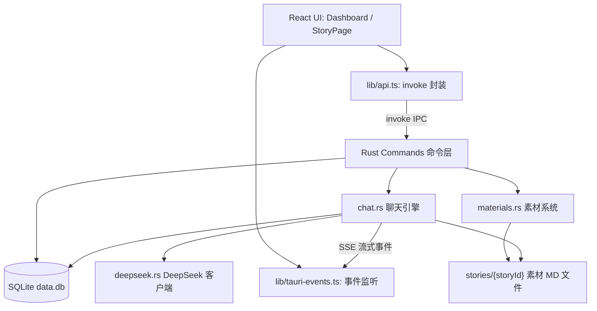
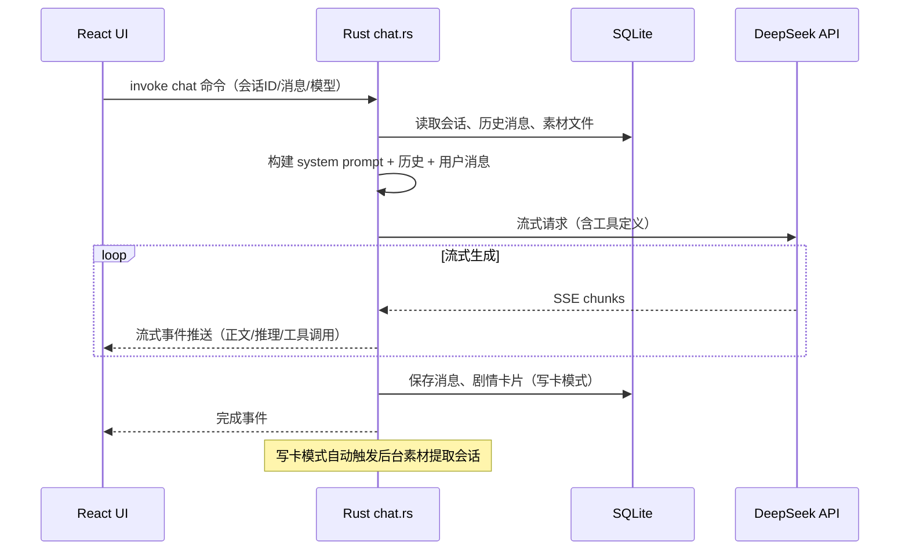

# StoryWalk — AI 小说生成器（Tauri 桌面应用）

StoryWalk 是一个 AI 辅助小说创作桌面应用。用户可创建故事，管理多个创作会话（sessions），通过 DeepSeek API 进行 AI 辅助写作，并通过可编辑的参考资料与创作准则（MD 素材文件）控制 AI 输出风格。

## 功能特性

- 故事管理：创建、编辑、删除故事，卡片式剧情速览
- 剧情卡片：写作产出的剧情自动沉淀为左侧卡片（按轮次排列），可编辑/删除/引用到聊天
- AI 辅助写作：DeepSeek API + SSE 流式输出，支持停止生成；角色性格驱动、用户主导方向
- 素材系统：`reference.md`（相关资料，注入 System Prompt）与 `guidelines.md`（创作准则，注入用户消息近因位置）；写作回复完成后后台自动提取新设定与文风偏好沉淀到素材文件
- 工具调用流式渲染：剧情卡片读写过程实时可见
- 原生桌面体验：自定义窗口标题栏、三栏可拖拽布局、消息虚拟滚动与分页懒加载

## 技术栈

- 前端：React 19、Vite 8、Tailwind CSS 4、React Router 7、shadcn/ui、Lucide 图标、react-virtuoso
- 后端：Tauri v2（Rust）、rusqlite（SQLite bundled）、reqwest（HTTP）、tokio（async）
- AI：DeepSeek API，SSE 流式 + Tauri Event 转发
- 桌面：tauri-plugin-opener、tauri-plugin-os

## 快速开始

| 命令 | 说明 |
|---|---|
| `npm run tauri dev` | 启动完整 Tauri 开发模式（Vite + cargo build + 原生窗口） |
| `npm run dev` | 仅启动前端 Vite dev server |
| `npm run build` | Vite 构建前端到 `dist/` |
| `npm run lint` | ESLint 检查 |

### 环境准备

1. 安装依赖：`npm install`
2. 配置 DeepSeek API Key：在项目根目录 `.env` 文件中设置 `DEEPSEEK_API_KEY=sk-xxx`
3. 启动开发：`npm run tauri dev`

## 参考项目（只读 submodule）

`reference/BitFun` 是外部参考项目（[GCWing/BitFun](https://github.com/GCWing/BitFun)）的只读 submodule，仅用于代码阅读与设计参考。

- **禁止编辑、修改该目录下的任何内容**，也禁止向其提交改动
- 如需更新参考版本，执行 `git submodule update --remote reference/BitFun`
- 克隆本项目后需执行 `git submodule update --init --recursive` 拉取该模块

## 系统架构

StoryWalk 是 Tauri v2 桌面应用，采用 **React 前端 + Rust 原生后端** 的分层架构，AI 能力由 DeepSeek API 提供。前后端**不通过 HTTP/REST 通信**：前端经 `@tauri-apps/api/core` 的 `invoke()` 调用 Rust 端 `#[tauri::command]`，流式输出由 Tauri Event 系统推送。



### 核心模块

- **命令层**（[src-tauri/src/commands](src-tauri/src/commands/)）：`stories` / `sessions` / `messages` / `story_cards` 的 CRUD，`chat` / `stop_chat` / `summarize_session`，`read_story_materials` / `update_story_materials` / `trigger_material_extraction`。
- **聊天引擎**（[chat.rs](src-tauri/src/chat.rs)）：写作会话（creation）的核心。按故事模式分流：
  - **写卡模式（card）**：暴露 4 个剧情卡片工具（`save_story_card` / `read_story_cards` / `read_story_card` / `update_story_card`），正文沉淀为左侧剧情卡片，支持 `[卡片:第N轮](card-xxx)` 与 `[第N轮:起始-结束]` 引用标记；回复完成后自动触发后台素材提取。
  - **纯聊模式（chat）**：AI 担任叙事者与 NPC，正文直接回复，不提供工具，注入 `overview.md` 剧情概览作为连续性锚点；素材沉淀由前端按钮手动触发（`trigger_material_extraction`）。
  - 消息构建顺序：system（参考资料 `reference.md` + 任务规则 + 工具说明/思维模式）→ 历史消息 → 创作准则 `guidelines.md` + 用户消息（近因位置，约束力最强）。
  - 流式输出经 Tauri Event 推送到前端，支持取消（共享 `CancelState`）；超长上下文由 [compression.rs](src-tauri/src/compression.rs) 压缩（保留尾部 + 摘要）。
- **素材系统**（[materials.rs](src-tauri/src/materials.rs)）：管理 `stories/<storyId>/` 下的 MD 素材文件；后台提取会话（mode=`extraction`）重放写作历史，通过素材工具（`read_story_md` / `patch_story_md` / `update_story_md`）将新设定与文风偏好沉淀到素材。
- **数据层**（[db.rs](src-tauri/src/db.rs)）：rusqlite（SQLite bundled），全局 `Mutex<Connection>` + `with_db`；版本化迁移（当前 v2）。四张表：

| 表 | 说明 |
|---|---|
| `stories` | 故事（含 `mode`：card / chat） |
| `story_sessions` | 会话（`mode`：creation 写作 / extraction 素材提取） |
| `story_messages` | 消息（含工具调用、推理内容、摘要标记） |
| `story_cards` | 剧情卡片（按轮次排列） |

- **AI 客户端**（[deepseek.rs](src-tauri/src/deepseek.rs)）：DeepSeek API 请求与 SSE 流式解析。

### 一次写作请求的数据流



## 项目结构

```
src/                    # 前端 React 应用
├── main.tsx            # 入口
├── App.tsx             # 路由 + AppToolbar 布局
├── pages/
│   ├── Dashboard.tsx        # 故事列表首页
│   └── StoryPage.tsx        # 故事创作页（三栏布局）
├── components/
│   ├── app-toolbar.tsx          # 顶部窗口标题栏（macOS 红绿灯 / Windows 自定义控件）
│   ├── chat-input.tsx           # 文本输入框
│   ├── story-cards-panel.tsx    # 故事卡片面板
│   ├── resizable-panel.tsx      # 三栏可拖拽面板
│   ├── scroll-to-bottom.tsx     # 滚动到底按钮
│   ├── status-bar.tsx           # 底部状态栏
│   └── ui/                      # shadcn UI 基础组件
├── lib/
│   ├── api.ts               # Tauri IPC invoke 封装
│   ├── tauri-events.ts      # Tauri Event 监听（streaming）
│   ├── mock-data.ts         # TypeScript 接口定义
│   └── utils.ts             # cn()

src-tauri/              # Rust 后端
├── Cargo.toml
├── tauri.conf.json
├── capabilities/default.json
└── src/
    ├── main.rs         # 入口
    ├── lib.rs          # Tauri Builder：窗口创建、命令注册
    ├── db.rs           # 数据库初始化、建表迁移
    ├── error.rs        # AppError 枚举
    ├── deepseek.rs     # DeepSeek API 客户端
    ├── chat.rs         # 写作聊天引擎 + 后台素材提取触发
    ├── compression.rs  # 上下文压缩（保留尾部/用户消息 + 摘要）
    ├── materials.rs    # 素材文件管理 + AI 工具（read/patch/update story_md）+ 后台素材提取任务
    ├── web_search.rs   # Exa 网络搜索
    └── commands/
        ├── stories.rs      # 故事 CRUD
        ├── sessions.rs     # 会话 CRUD
        ├── messages.rs     # 消息 CRUD + rollback
        └── story_cards.rs  # 故事卡片 CRUD
```

## 配置说明

- 环境变量：`DEEPSEEK_API_KEY` 配置在项目根目录 `.env` 文件中
- Tauri 权限：`src-tauri/capabilities/default.json` 控制窗口控制等原生权限
- 数据库：`data.db` 位于项目根目录（开发模式），由 Rust 端 rusqlite 管理
- 故事素材：每个故事的 MD 素材文件存放于 `stories/<storyId>/` 目录

## 构建与发布

- 生产构建：`npm run tauri build`（生成安装包）
- 前端单独构建：`npm run build`

## 许可

[MIT](LICENSE)
